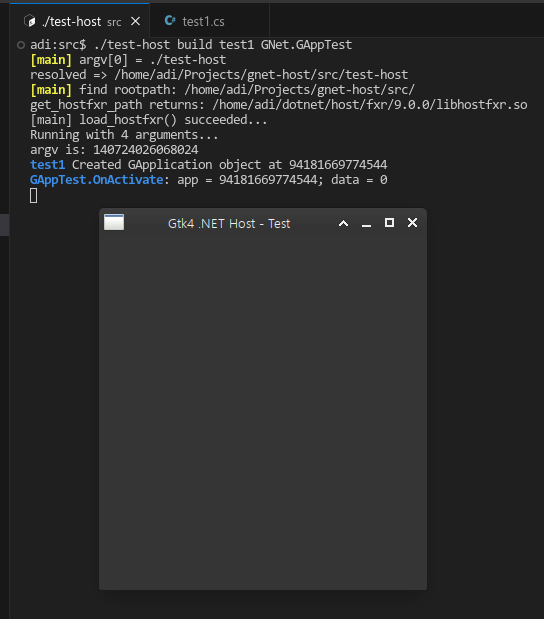

# Simple Host

This host knows nothing about your purposes, and just use `UnmanagedCallersOnly`
function named `int Run(int argc, IntPtr argv)`.

You can use `argv` with `Marshal`.

This project uses `.NET Core SDK 9`.

## Screenshot

